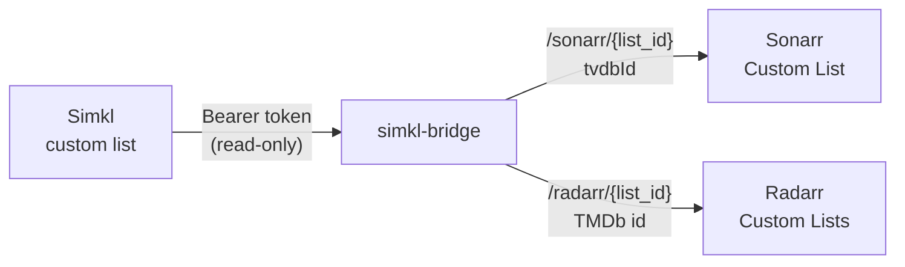

# simkl-bridge

[](https://github.com/jad0083/simkl-bridge/actions/workflows/image.yml)

Import your **Simkl custom lists** into **Sonarr** and **Radarr**.

Sonarr and Radarr can already import Simkl's *status* lists (Watching, Plan to
Watch, and so on). Neither can import a list you have curated yourself. Simkl's
[custom-list API](https://api.simkl.org/guides/custom-lists) needs an OAuth
Bearer token, and the arrs' generic *Custom List* import can only fetch a plain
URL. simkl-bridge sits in between. It holds the token, reads the list, maps
every title to the id each app expects, and serves JSON those import lists
already understand.



- **No dependencies.** Python standard library only, in a small non-root container.
- **Read-only.** It asks Simkl for the `media:read` scope and never writes.
- **Safe with library cleaning.** An error is never served as an empty or
  partial list. See [Behaviour](#behaviour).
- **Anime aware.** An anime list feeds both apps: series, OVAs, ONAs and
  specials go to Sonarr, and films go to Radarr.

## Requirements

- A Simkl **PRO or VIP** account. Simkl limits the custom-list API to those plans.
- A Simkl **AUTH V2** app registration (free, below).
- Sonarr and Radarr that can reach the bridge over HTTP, usually on a shared Docker network.

## Quick start

### 1. Register a Simkl app

On simkl.com go to **Settings → Developer** and create a new **AUTH V2** app
with client type **TV, devices & command line**. Note its `client_id`. This
client type has no secret.

### 2. Get a refresh token (once)

```sh
docker run --rm -it -e SIMKL_CLIENT_ID=<client_id> \
  -e XDG_RUNTIME_DIR=/out -v "$PWD:/out" --user "$(id -u)" \
  ghcr.io/jad0083/simkl-bridge:<tag> auth
```

Open the printed link, signed in to your PRO/VIP account, and approve. The
refresh token is written to `./simkl-refresh-token.secret` with mode `0600`.
It is never printed; you see only its length and a SHA-256 prefix. Put it
in your secret store and delete the file.

The refresh token is valid for 180 days and renews itself every time the
bridge uses it, so this is a one-time step.

### 3. Run it

```yaml
services:
  simkl-bridge:
    image: ghcr.io/jad0083/simkl-bridge:<tag>
    container_name: simkl-bridge
    restart: unless-stopped
    environment:
      - SIMKL_CLIENT_ID=${SIMKL_CLIENT_ID}
      - SIMKL_REFRESH_TOKEN=${SIMKL_REFRESH_TOKEN}
    volumes:
      - ./simkl-bridge:/data      # must be writable by uid 10001
    networks:
      - media                    # the network Sonarr and Radarr are on

networks:
  media:
    external: true
```

No port needs publishing. Only Sonarr and Radarr need to reach it, and the
bridge has no authentication of its own, so keep it off public networks.

### 4. Point Sonarr and Radarr at it

The list id is the number in the list's URL on simkl.com.

| App | Where | URL |
|---|---|---|
| Sonarr | Settings → Import Lists → **Custom List** | `http://simkl-bridge:8080/sonarr/<list_id>` |
| Radarr | Settings → Lists → **Custom Lists** | `http://simkl-bridge:8080/radarr/<list_id>` |

For an anime list, add it to Sonarr with *Series Type* set to **Anime**, and to
Radarr as well if it contains films.

Press **Test**. A misconfigured list fails with a readable message instead of
syncing nothing. For example, a movie list pointed at Sonarr, a non-PRO account,
or an unknown list id.

## Faster syncs (optional)

Sonarr checks a Custom List at most every **6 hours**, and Radarr every
**12 hours**. Those minimums are hardcoded per list type. A sync requested
for one specific list skips them, though, and the bridge can request it for
you. Give it each app's URL and API key, and it watches your Simkl lists.
When one changes, it asks exactly the Sonarr/Radarr lists that point at it
to re-read now. New titles then arrive within minutes of being added on
simkl.com.

```yaml
    environment:
      - SONARR_URL=http://sonarr:8989
      - SONARR_API_KEY=${SONARR_API_KEY}
      - RADARR_URL=http://radarr:7878
      - RADARR_API_KEY=${RADARR_API_KEY}
```

- **Discovery is automatic.** Any Sonarr *Custom List* or Radarr *Custom
  Lists* entry whose URL ends in this bridge's `/sonarr/<id>` or
  `/radarr/<id>` is watched. Nothing else is touched.
- **Cheap.** Each check is a single `/sync/activities` call, which only moves
  when one of your lists changes. Lists owned by someone else are checked in
  full every hour, since your activity feed doesn't cover them.
- **Disabled lists are left alone**, as are lists outside `BRIDGE_LISTS`.
  A change that can't be completed (Simkl unreachable, an app down, a sync
  rejected) is retried on the next check, not dropped.
- **Library cleaning.** A triggered Sonarr sync runs Sonarr's *Clean Library*
  step if you have it enabled, the same as its scheduled sync does. The bridge
  never serves a partial list, so cleaning only ever sees the complete list.
- **API keys are admin keys.** Neither app offers a read-only key. Treat them
  like the Simkl token: from a secret store, never logged (the bridge doesn't).
  Leave both unset to keep the bridge pull-only.

## Routes

| Route | Returns |
|---|---|
| `GET /sonarr/{list_id}` | `[{"title", "tvdbId", "imdbId"}]` |
| `GET /radarr/{list_id}` | `[{"id", "imdb_id", "title"}]` (`id` is the TMDb id) |
| `GET /healthz` | `{"status": "ok"}` |

## Configuration

| Variable | Required | Default | |
|---|---|---|---|
| `SIMKL_CLIENT_ID` | yes | | AUTH V2 app client id |
| `SIMKL_REFRESH_TOKEN` | yes | | from the `auth` step |
| `SIMKL_CLIENT_SECRET` | no | | only for a *server* app registration |
| `BRIDGE_LISTS` | no | any | comma-separated list ids this instance will serve |
| `BRIDGE_MIN_REFRESH` | no | `900` | seconds a list is served from cache before re-checking |
| `BRIDGE_DATA_DIR` | no | `/data` | where the access token and id cache are kept (`0600`) |
| `BRIDGE_PORT` | no | `8080` | |
| `SONARR_URL`, `SONARR_API_KEY` | no | | enable change-driven syncs for Sonarr (both or neither) |
| `RADARR_URL`, `RADARR_API_KEY` | no | | enable change-driven syncs for Radarr (both or neither) |
| `BRIDGE_WATCH_INTERVAL` | no | `180` | seconds between change checks (minimum 30) |
| `BRIDGE_FULL_CHECK` | no | `3600` | seconds between full checks of every watched list |

## Behaviour

**An error is never an empty list.** Sonarr and Radarr can remove titles that
disappear from an import list. So any failure (Simkl unreachable, rate
limited, token rejected, list private) returns a non-200 with the reason, and
the app simply retries on its next sync. A list read is also accepted only if
it is provably complete: every page present, stable while it was read, and the
item count matching Simkl's total.

**Titles without a usable id are skipped and logged.** Sonarr needs a TVDB id
and Radarr a TMDb id. Simkl list items usually carry both. When one is missing
the bridge asks Simkl's catalog once and caches the answer. A title that has no
mapping at all is left out, and the bridge logs its name. A film is never sent by
IMDb id alone, because Radarr would fall back to a title search and could pick
the wrong film.

**Gentle on Simkl.** Lists are re-read only when their `updated_at` moves, and
at least daily. Requests are paced under Simkl's rate limit, with backoff on
`429`/`5xx`. Id lookups go to Simkl's cached catalog endpoints without a token,
as Simkl asks.

**Tokens.** Access tokens last 7 days. The bridge refreshes its own a day
before expiry, or on a `401`, and stores it in its data directory. It must be
the only process using that refresh token: refreshing one grant from two
places makes them invalidate each other.

## Limitations

- Simkl's custom-list API is in **beta** and read-only.
- A list larger than 10,000 items can't be read through the API. The bridge
  refuses it rather than serve a truncated list.
- Sonarr 4.x's Custom List accepts only TVDB ids. Titles Simkl cannot map to TVDB
  are skipped.

## Development

```sh
python3 -m venv .venv && .venv/bin/pip install pytest
.venv/bin/pytest
docker build -t simkl-bridge:dev .
```

The tests run against a scripted Simkl, so no account is needed.
[`docs/design.md`](docs/design.md) records the decisions and why.

Images are published to `ghcr.io/jad0083/simkl-bridge`, tagged with the
short commit hash of each push to `main`.

---

Not affiliated with Simkl. List data comes from [Simkl](https://simkl.com).
