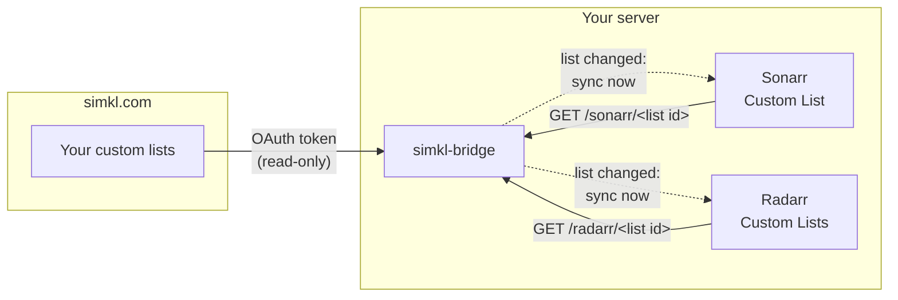
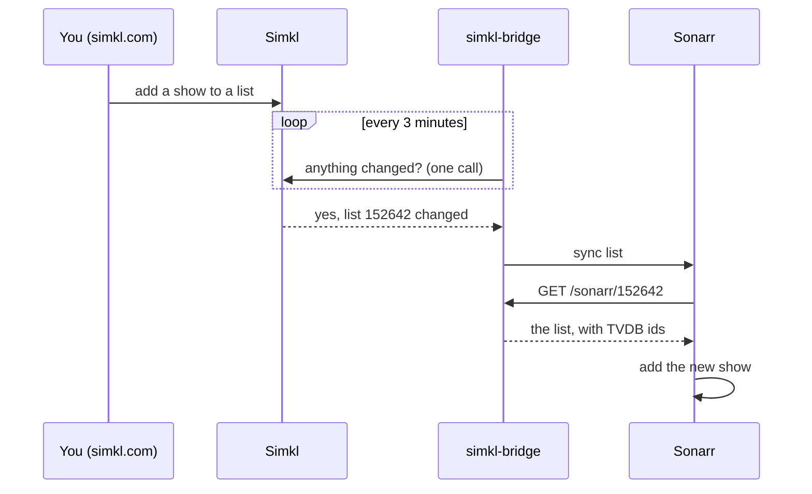

# simkl-bridge: Simkl custom lists for Sonarr and Radarr

[](https://github.com/jad0083/simkl-bridge/actions/workflows/ci.yml)
[](https://github.com/jad0083/simkl-bridge/actions/workflows/e2e.yml)
[](https://github.com/jad0083/simkl-bridge/actions/workflows/soak.yml)
[](https://github.com/jad0083/simkl-bridge/pkgs/container/simkl-bridge)


**Use your Simkl custom lists as import lists in Sonarr and Radarr.** Add a
show, movie or anime to a list on simkl.com, and it lands in your \*arr
library automatically, within minutes rather than the usual 6 to 12 hours.

simkl-bridge is a small self-hosted Docker service. It reads your
[Simkl](https://simkl.com) custom lists through Simkl's
[custom-list API](https://api.simkl.org/guides/custom-lists) and serves them in
the *Custom List* format Sonarr and Radarr already import. It can also tell
Sonarr and Radarr to sync the moment a list changes.

- **Any custom list:** yours or anyone's public list; TV, movies or anime.
- **Fast syncs:** new titles reach Sonarr/Radarr in about 3 minutes, not 6–12 hours.
- **Anime aware:** series, OVAs and specials go to Sonarr; anime films go to Radarr.
- **Safe:** read-only against Simkl. It never serves an empty or partial list,
  so it can't make your \*arr drop titles.
- **Tiny:** Python standard library only, one non-root container (amd64 and
  arm64), no database.
- **Tested end to end:** every change runs against real Sonarr and Radarr
  containers, plus an hour-long fault-injection soak every night. See
  [Testing](#testing).

---

**Contents:**
[Why](#why-sonarr-and-radarr-cant-do-this-on-their-own) ·
[How it works](#how-it-works) ·
[Setup guide](#setup-guide) ·
[Add a list](#part-2-add-a-list) ·
[Common layouts](#common-layouts) ·
[Fast syncs](#how-fast-syncs-work) ·
[Configuration](#configuration) ·
[Troubleshooting](#troubleshooting) ·
[FAQ](#faq)

---

## Why Sonarr and Radarr can't do this on their own

Simkl lets PRO and VIP members build **custom lists**: "Anime to watch
this season", "Comfort rewatches", a friend's recommendations, and so on.
Getting those into Sonarr or Radarr isn't possible out of the box:

| | Sonarr / Radarr today | With simkl-bridge |
|---|---|---|
| Simkl **status** lists (Watching, Plan to Watch, …) | ✅ Built-in *Simkl User* list | ✅ unchanged |
| Simkl **custom** lists | ❌ No option for them | ✅ Any list by id |
| Simkl login for custom lists (OAuth Bearer token) | ❌ The generic *Custom List* import can only fetch a plain URL | ✅ The bridge holds and renews the token |
| IDs the apps need (TVDB for Sonarr, TMDb for Radarr) | ❌ Not a format they can read from Simkl | ✅ Mapped per title |
| How often a list is checked | Sonarr **6 h**, Radarr **12 h** (hardcoded) | ✅ **~3 minutes** after a change |

Simkl only opened custom lists to its API recently (beta, read-only, PRO/VIP
accounts). Radarr's request for custom-list support was closed in 2024
because no API existed then. Until the \*arrs support it natively, the bridge
fills the gap.

## How it works



1. **Sonarr and Radarr pull.** Each list you add in Sonarr/Radarr is a
   *Custom List* pointing at the bridge: `http://simkl-bridge:8080/sonarr/<id>`
   or `/radarr/<id>`. When the app asks, the bridge reads that list from
   Simkl and answers with each title's TVDB id (Sonarr) or TMDb id (Radarr).
2. **The bridge pushes a nudge (optional).** Given each app's API key, the
   bridge watches Simkl. When a list changes, it tells exactly the
   Sonarr/Radarr lists using it to sync *now*. The apps then pull as in
   step 1, just much sooner. [Details below](#how-fast-syncs-work).

The bridge stores nothing but its access token and a cache of id mappings.
Sonarr and Radarr stay in charge of what gets added and how.

## Setup guide

There are two parts:

- **[Part 1: one-time setup](#part-1-one-time-setup)** (about 15 minutes). A
  Simkl app, a sign-in, and the container.
- **[Part 2: add a list](#part-2-add-a-list)** (about 2 minutes, per list).
  Repeat it for every Simkl list you want in Sonarr or Radarr.

### Before you start

| You need | Notes |
|---|---|
| A Simkl **PRO or VIP** account | Simkl only offers custom lists through its API on these plans |
| Docker with Compose | The bridge runs as one small container |
| Sonarr v4 and/or Radarr | Tested with Sonarr 4.0.20 and Radarr 6.4.4, stable and develop builds |
| The Docker network Sonarr/Radarr are on | The bridge must join it. To find it: `docker inspect sonarr --format '{{range $k, $v := .NetworkSettings.Networks}}{{$k}} {{end}}'` |

---

### Part 1: one-time setup

#### Step 1: Register a Simkl app

1. Sign in at [simkl.com](https://simkl.com) and open **Settings → Developer**.
2. Choose **Add** / create a new app, and pick **AUTH V2**.
3. **App type: TV, devices & command line.** ⚠️ Pick exactly this one. It
   can't be changed later, and the other types (mobile/desktop, server) use
   a sign-in the bridge doesn't support.
4. **Name:** anything. Simkl asks that names mentioning Simkl read "*… for
   Simkl*", e.g. *List Bridge for Simkl*. Leave the optional fields empty.
5. Create it and copy the **Client ID** (a 64-character code). It's public;
   this app type has no secret.

#### Step 2: Sign in once to get a refresh token

Run this in the folder where you'll keep the bridge's files, replacing
`<client_id>`:

```sh
docker run --rm -it -e SIMKL_CLIENT_ID=<client_id> \
  -e XDG_RUNTIME_DIR=/out -v "$PWD:/out" --user "$(id -u)" \
  ghcr.io/jad0083/simkl-bridge:latest auth
```

1. It prints a link like `https://simkl.com/pin?user_code=ABCD-EFGH`. Open it,
   signed in to your **PRO/VIP** account, and approve. The bridge asks only for
   **read** access.
2. It saves the refresh token to `./simkl-refresh-token.secret`. The token is
   never shown on screen; you see its length and a fingerprint, so you can
   confirm it later without revealing it.
3. Copy the file's contents into your `.env` (Step 4), then delete the file.

You only do this once. The refresh token lasts 180 days and renews itself
every time the bridge uses it.

#### Step 3: Copy Sonarr's and Radarr's API keys (for fast syncs)

This is optional but recommended: it makes new titles arrive in about 3 minutes
instead of 6–12 hours (see [How fast syncs work](#how-fast-syncs-work)).

In each app: **Settings → General → Security → API Key**. Copy it. Skip this
step to run the bridge pull-only.

#### Step 4: Create `.env`

Next to your `compose.yaml`:

```ini
SIMKL_CLIENT_ID=<the client ID from step 1>
SIMKL_REFRESH_TOKEN=<the contents of simkl-refresh-token.secret>
# Fast syncs (step 3). Leave both lines of an app out to skip it.
SONARR_API_KEY=<Sonarr's API key>
RADARR_API_KEY=<Radarr's API key>
```

Keep `.env` private (`chmod 600 .env`). The bridge never logs these values.

#### Step 5: Add the bridge to Compose

**If Sonarr and Radarr are in the same `compose.yaml`**, add this service to
it. Services in one Compose project share a network by default, so there's
nothing else to set:

```yaml
  simkl-bridge:
    image: ghcr.io/jad0083/simkl-bridge:latest
    container_name: simkl-bridge
    restart: unless-stopped
    environment:
      - SIMKL_CLIENT_ID=${SIMKL_CLIENT_ID}
      - SIMKL_REFRESH_TOKEN=${SIMKL_REFRESH_TOKEN}
      - SONARR_URL=http://sonarr:8989        # your Sonarr's container name and port
      - SONARR_API_KEY=${SONARR_API_KEY}
      - RADARR_URL=http://radarr:7878        # your Radarr's container name and port
      - RADARR_API_KEY=${RADARR_API_KEY}
    volumes:
      - ./simkl-bridge:/data
```

**If they run elsewhere**, give the bridge its own `compose.yaml` and join
their network (the name from [Before you start](#before-you-start)):

```yaml
services:
  simkl-bridge:
    # ...same as above...
    networks: [media]

networks:
  media:
    external: true
    name: media                              # replace with your network's name
```

Things to check:
- **`SONARR_URL` / `RADARR_URL`** use the container **name** and **internal
  port**, not a published port or a public domain. If Sonarr is served under a
  URL base (e.g. `/sonarr`), include it: `http://sonarr:8989/sonarr`.
- **The data folder** must be writable by the container's user (uid 10001):
  `mkdir -p simkl-bridge && sudo chown 10001:10001 simkl-bridge`.
- **No port is published.** Sonarr and Radarr reach the bridge by name. It has
  no login of its own, so **don't expose it to the internet**.

#### Step 6: Start it and check it

```sh
docker compose up -d simkl-bridge
docker logs simkl-bridge
```

You should see:

```
watching for list changes every 180s; syncs go to sonarr, radarr
simkl-bridge listening on :8080
```

The first line only appears with fast syncs on. Then check that Sonarr and
Radarr can reach the bridge:

```sh
docker exec sonarr curl -s http://simkl-bridge:8080/healthz      # {"status": "ok"}
docker exec radarr curl -s http://simkl-bridge:8080/healthz
```

Setup is done. Now add lists.

---

### Part 2: add a list

Repeat these steps for each Simkl list.

#### Step 1: Create the list on Simkl (or pick an existing one)

1. On simkl.com, open your profile's **Lists** section and create a **new
   list**.
2. **Choose its type** (TV, Movies or Anime). A Simkl list holds one type, and
   the type decides which app it can feed (step 3).
   - **Anime films go in an Anime list**, not a Movies list: Simkl files them
     as anime.
   - **An Anime list can mix series and films.** The bridge splits it for you.
3. Add titles from any title's page with **Add to list**.

You can also use **someone else's list**, as long as it's **public** or
**unlisted**. Private lists can only be read by their owner.

#### Step 2: Copy the list ID

Open the list on simkl.com. The **number in the page address** is the list
ID, e.g. `152642`.

#### Step 3: Decide which app(s) get it

| Simkl list type | Add it to | List URL |
|---|---|---|
| **TV** | Sonarr | `http://simkl-bridge:8080/sonarr/<list id>` |
| **Movies** | Radarr | `http://simkl-bridge:8080/radarr/<list id>` |
| **Anime**, series only | Sonarr | `http://simkl-bridge:8080/sonarr/<list id>` |
| **Anime**, films only | Radarr | `http://simkl-bridge:8080/radarr/<list id>` |
| **Anime**, series *and* films | **both**, with the same list ID | both URLs above |

**How anime is split:** each anime title has a subtype on Simkl. **Movie** goes
to Radarr; **TV, OVA, ONA and special** go to Sonarr. A title only ever reaches
one app. If you add an anime list to Radarr and it has no films yet, Radarr
simply gets an empty list, which is normal, and films you add later arrive
automatically.

#### Step 4a: Add it to Sonarr

**Settings → Import Lists → + (Add List)**, then under **Advanced** choose
**Custom List**:

| Field | What to set |
|---|---|
| **Name** | Anything, e.g. `Simkl – Anime` |
| **Enable Automatic Add** | ✅ On, or titles are only listed, never added |
| **Monitor** | Your preference (e.g. *All Episodes*) |
| **Monitor New Items** | Your preference |
| **Root Folder** | Where these series belong (e.g. your anime folder for an anime list) |
| **Quality Profile** | Your preference |
| **Series Type** | **Anime** for an anime list; **Standard** otherwise |
| **Season Folder** | Your preference |
| **Search for Missing Episodes** | On, to start downloading when a series is added |
| **List URL** | `http://simkl-bridge:8080/sonarr/<list id>` |

#### Step 4b: Add it to Radarr

**Settings → Lists → + (Add List)**, then under **Advanced** choose
**Custom Lists**:

| Field | What to set |
|---|---|
| **Name** | Anything, e.g. `Simkl – Anime films` |
| **Enable** and **Enable Automatic Add** | ✅ Both on |
| **Monitor** | Usually *Movie Only* |
| **Minimum Availability** | Usually *Released* |
| **Quality Profile** | Your preference |
| **Root Folder** | Where these films belong (e.g. your anime movies folder) |
| **Search on Add** | On, to start downloading when a film is added |
| **List URL** | `http://simkl-bridge:8080/radarr/<list id>` |

#### Step 5: Test, save, and check

1. Press **Test**. It should succeed. If it doesn't, the message says why
   (see [Troubleshooting](#troubleshooting)). The usual causes are a movie list
   pointed at Sonarr (or the reverse) and a wrong list ID.
2. Press **Save**.
3. To see exactly what the app will receive:
   ```sh
   docker exec sonarr curl -s http://simkl-bridge:8080/sonarr/<list id>
   ```
   Each title appears with its TVDB ID (Sonarr) or TMDb ID (Radarr).

**When titles appear:** Radarr syncs a new list as soon as it's saved. Sonarr
doesn't sync a list when it's added, only when it's edited, so with fast syncs
on, the bridge syncs it within about 3 minutes. Without fast syncs it waits for
Sonarr's own schedule. From then on the list stays in sync by itself; there's
nothing to change on the bridge.

#### Step 6 (optional): Watch a fast sync

Add a title to the list on simkl.com. Within about 3 minutes the bridge logs:

```
watch: list 152642 changed; sonarr list #3 sync requested
```

Then Sonarr's own log shows *Import List Sync Completed … Series added: 1*.

---

### Common layouts

| You want | Do this |
|---|---|
| A TV watchlist in Sonarr | TV list → Sonarr only |
| A movie watchlist in Radarr | Movies list → Radarr only |
| One anime list for everything | Anime list → **both** apps with the same ID. In Sonarr set *Series Type: Anime* and your anime root folder; in Radarr use your anime-movies root folder |
| Anime films kept separate | A second Anime list with only films → Radarr only |
| A friend's recommendations | Their public list's ID → the matching app. Changes arrive within the full-check interval (`BRIDGE_FULL_CHECK`, e.g. 15 min at `900`) |

## How fast syncs work

Out of the box, Sonarr re-checks a Custom List at most every **6 hours** and
Radarr every **12 hours**. Those minimums are hardcoded in each app, but a
sync requested for one specific list is honoured immediately. With the API
keys from [Step 3](#step-3-copy-sonarrs-and-radarrs-api-keys-for-fast-syncs),
the bridge makes that request for you:



| List | Typical delay | Why |
|---|---|---|
| Your own lists | **~3 minutes** (18 seconds measured) | Simkl keeps one account-wide "last changed" stamp for your lists; the bridge checks it every 3 min |
| Someone else's list | **up to 1 hour** by default; 15 min with `BRIDGE_FULL_CHECK=900` | Their edits don't move *your* stamp, so a periodic full check catches them |

**What it does automatically:**
- **Finds lists by itself.** Any Sonarr *Custom List* or Radarr *Custom Lists*
  entry whose URL points at the bridge is watched, including ones added later.
  Each is synced once when first seen, and after a restart, to catch up.
- **Syncs only what changed,** and only in the apps using that list. Disabled
  lists are left alone.
- **Makes sure the app really got it.** A sync counts only once the app has
  actually fetched the list. If its fetch failed, for example on a Simkl
  hiccup, the bridge asks again, rather than leaving it to the app's own
  6–12 hour retry.
- **Costs almost nothing:** one small call every 3 minutes, whatever the number
  of lists (about 480 a day). Simkl allows 1,000 (PRO) or 10,000 (VIP) a day per
  user, shared with your other Simkl apps.

**Good to know:**
- **The stamp starts working after your first list edit.** Simkl leaves the
  "last changed" stamp empty until you first edit a list. Until then, your own
  lists are caught by the full check.
- **API keys are admin keys.** Neither app offers a read-only key. The bridge
  only ever sends them to the URL you configured and never logs them. Leave
  them out to keep the bridge pull-only.

## Configuration

| Variable | Required | Default | What it does |
|---|---|---|---|
| `SIMKL_CLIENT_ID` | **yes** | | Your Simkl AUTH V2 app's client ID |
| `SIMKL_REFRESH_TOKEN` | **yes** | | From the one-time `auth` step |
| `SONARR_URL`, `SONARR_API_KEY` | no | | Enable fast syncs for Sonarr (set both or neither) |
| `RADARR_URL`, `RADARR_API_KEY` | no | | Enable fast syncs for Radarr (set both or neither) |
| `BRIDGE_WATCH_INTERVAL` | no | `180` | Seconds between change checks (minimum 30) |
| `BRIDGE_FULL_CHECK` | no | `3600` | Seconds between full checks, which catch other people's lists; `900` is a good value if you use them |
| `BRIDGE_LISTS` | no | all | Comma-separated list IDs this bridge may serve |
| `BRIDGE_MIN_REFRESH` | no | `900` | Seconds a list is served from cache before re-checking Simkl |
| `BRIDGE_DATA_DIR` | no | `/data` | Where the access token and ID cache live (mode `0600`) |
| `BRIDGE_PORT` | no | `8080` | Listening port |
| `SIMKL_CLIENT_SECRET` | no | | Only for a *server*-type Simkl app (not recommended) |
| `SIMKL_API_BASE` | no | `https://api.simkl.com` | For testing against a stand-in Simkl |

**Endpoints:** `GET /sonarr/<list id>` (Sonarr Custom List JSON with
`tvdbId`), `GET /radarr/<list id>` (Radarr Custom Lists JSON with the TMDb
`id`), and `GET /healthz`.

**Images** (`linux/amd64` and `linux/arm64`, e.g. a Raspberry Pi 4/5):

| Tag | What it is |
|---|---|
| `:latest` | The latest release |
| `:0.3.0`, `:0.3` | A release, or the newest patch of a minor version |
| `:edge` | The newest build of `main`, which passed every check |
| `:<12-char commit>` | One exact build: pin this, with its digest, for reproducible deployments |

## Troubleshooting

What **Test** in Sonarr/Radarr (or `curl http://simkl-bridge:8080/sonarr/<id>`) tells you:

| Result | Meaning | Fix |
|---|---|---|
| `404 … not found` | No list with that ID | Check the number in the list's URL |
| `400 … holds movies; point radarr at …` | A movie list was added to Sonarr, or a TV list to Radarr | Use the other app |
| `502 … not Simkl PRO or VIP` | The signed-in account isn't PRO/VIP | Custom lists need PRO/VIP |
| `502 … HTTP 403 private_list` | The list is private | Ask the owner to make it public or unlisted |
| `502 … token refresh failed` | The refresh token was revoked or is from another app | Re-run the `auth` step |
| `403 … not in BRIDGE_LISTS` | You restricted which lists are served | Add the ID to `BRIDGE_LISTS` |
| A title never appears | Simkl has no TVDB (Sonarr) or TMDb (Radarr) id for it | `docker logs simkl-bridge` names each skipped title |
| Log: `… still hasn't fetched after 5 re-requests; giving up` | The app accepted the sync request but its fetch keeps failing or never arrives | Check that app's own log (*System → Logs*) for the error. Its fetch must come from the app itself: a proxy that rewrites its `User-Agent` hides it from the bridge |
| Log: `sonarr unreachable` / `radarr unreachable` | `SONARR_URL` / `RADARR_URL` is wrong, or the bridge isn't on their network | Use the container name and internal port, plus any URL base; see [Step 5](#step-5-add-the-bridge-to-compose) |

The bridge never answers an error with an empty list. Sonarr/Radarr simply
retry later, and nothing is removed from your library.

## FAQ

**Doesn't Sonarr already support Simkl?**
Only your status lists (Watching, Plan to Watch, Completed, …) via the
built-in *Simkl User* list. Custom lists aren't supported by Sonarr or Radarr.

**Will titles be removed if I take them off the Simkl list?**
Only if you've enabled *Clean Library* on the list in Sonarr/Radarr; by
default nothing is removed. Either way, a Simkl outage can never look like an
empty list: the bridge returns an error instead.

**Does it work with a free Simkl account?**
No. Simkl only gives PRO and VIP accounts access to custom lists through its API.

**Can I use a friend's list, or a public list I found?**
Yes, if it's public or unlisted. Use its ID like any other list. Its changes
arrive within your `BRIDGE_FULL_CHECK` interval.

**How does anime work?**
An anime list can feed both apps. Series, OVAs, ONAs and specials go to
Sonarr (set *Series Type: Anime*); anime films go to Radarr. Simkl often
lists anime by season ("… Season 2"); Sonarr adds the whole series, which is
what Sonarr expects.

**Does it write anything to Simkl?**
No. It asks for read-only access and never writes.

**Why not sync my Simkl lists to Trakt and use the Trakt lists instead?**
You can, but it takes another service in the middle. Trakt's free tier
limits lists to 100 items, and changes still wait for the 12-hour Trakt
list minimum.

## Limitations

- Simkl's custom-list API is in **beta**. The bridge follows its documented
  behaviour and is tested against a live account.
- Lists over 10,000 items can't be read through the API. The bridge refuses
  them rather than serve a truncated list.
- Sonarr 4.x needs a TVDB id, and Radarr a TMDb id. Titles Simkl can't map are
  skipped and logged.

## Testing

Every pull request and push to `main` runs:

| Check | What it proves |
|---|---|
| **Unit and integration tests** on Python 3.11, 3.12 and 3.13 | The logic, plus the real bridge process over real HTTP against a stand-in Simkl that mimics Simkl's quirks (silent page clamping, `premium_only`, expiring tokens) |
| **Container smoke test** | The image runs as non-root, rejects bad config with a clear message, becomes healthy, works with a read-only root filesystem, and never logs a token |
| **Vulnerability scan** (Trivy) | No fixable HIGH or CRITICAL issues in the image |
| **End to end** against real Sonarr and Radarr: stable builds, develop builds, and under a URL base | Titles are actually added; a list edit reaches both apps through a targeted sync within 2 minutes; a movie list offered to Sonarr is refused with a reason; with Sonarr's list cleaning on, a Simkl outage unmonitors nothing |
| **Soak**: 4 minutes per change, 60 minutes nightly | Under sustained Simkl faults (429s, 503s, dropped connections, slow replies, tokens expiring every ~40 s) and constant list edits: never a partial, mixed or empty answer; every edit delivered; no memory or thread growth; no crash |

The end-to-end suite also runs weekly, so a new Sonarr or Radarr release that
breaks the integration is caught even when nothing here has changed.

**Tested with:** Sonarr 4.0.20, Radarr 6.4.4 (and their develop builds at the
time of each run).

## Development

```sh
python3 -m venv .venv && .venv/bin/pip install pytest
.venv/bin/pytest                               # unit + integration; no account needed
docker build -t simkl-bridge:dev .
tests/container/smoke.sh simkl-bridge:dev      # container checks
PYTHON=.venv/bin/python tests/e2e/run.sh       # real Sonarr/Radarr (Docker, internet)
.venv/bin/python tests/soak/soak.py --minutes 5
```

`tests/support/fake_simkl.py` is a standalone stand-in for Simkl's API; point
the bridge at it with `SIMKL_API_BASE`. [`docs/design.md`](docs/design.md)
explains the design decisions and why. Issues and pull requests are welcome.

**Releasing:** bump `__version__` in `src/simkl_bridge/__init__.py`, merge,
then push a tag `vX.Y.Z` on that commit. CI verifies the tag matches, runs
everything, publishes the images and creates the GitHub Release.

---

*Not affiliated with or endorsed by Simkl, Sonarr or Radarr. List data comes
from [Simkl](https://simkl.com).*
