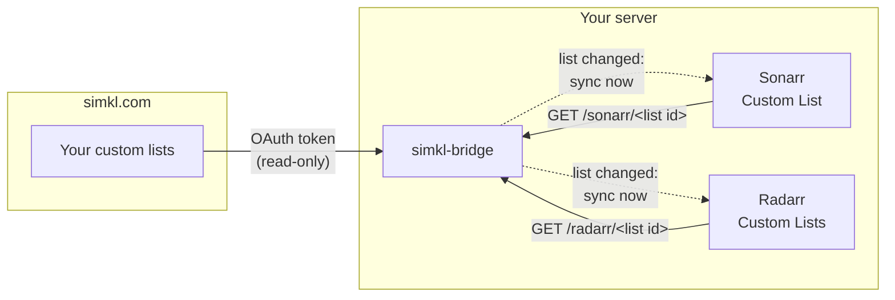

# simkl-bridge: Simkl custom lists for Sonarr and Radarr

[](https://github.com/jad0083/simkl-bridge/actions/workflows/image.yml)
[](https://github.com/jad0083/simkl-bridge/pkgs/container/simkl-bridge)


**Use your Simkl custom lists as import lists in Sonarr and Radarr.** Add a
show, movie or anime to a list on simkl.com, and it lands in your \*arr
library automatically, within minutes rather than the usual 6 to 12 hours.

simkl-bridge is a small self-hosted Docker service. It reads your
[Simkl](https://simkl.com) custom lists through Simkl's
[custom-list API](https://api.simkl.org/guides/custom-lists) and serves them in
the *Custom List* format Sonarr and Radarr already import. It can also tell
Sonarr and Radarr to sync the moment a list changes.

- **Any custom list:** yours or anyone's public list; TV, movies or anime.
- **Fast syncs:** new titles reach Sonarr/Radarr in about 3 minutes, not 6–12 hours.
- **Anime aware:** series, OVAs and specials go to Sonarr; anime films go to Radarr.
- **Safe:** read-only against Simkl. It never serves an empty or partial list,
  so it can't make your \*arr drop titles.
- **Tiny:** Python standard library only, one non-root container, no database.

---

**Contents:**
[Why](#why-sonarr-and-radarr-cant-do-this-on-their-own) ·
[How it works](#how-it-works) ·
[Setup](#setup) ·
[Adding lists](#adding-lists) ·
[Fast syncs](#fast-syncs-new-titles-in-minutes) ·
[Configuration](#configuration) ·
[Troubleshooting](#troubleshooting) ·
[FAQ](#faq)

---

## Why Sonarr and Radarr can't do this on their own

Simkl lets PRO and VIP members build **custom lists**: "Anime to watch
this season", "Comfort rewatches", a friend's recommendations, and so on.
Getting those into Sonarr or Radarr isn't possible out of the box:

| | Sonarr / Radarr today | With simkl-bridge |
|---|---|---|
| Simkl **status** lists (Watching, Plan to Watch, …) | ✅ Built-in *Simkl User* list | ✅ unchanged |
| Simkl **custom** lists | ❌ No option for them | ✅ Any list by id |
| Simkl login for custom lists (OAuth Bearer token) | ❌ The generic *Custom List* import can only fetch a plain URL | ✅ The bridge holds and renews the token |
| IDs the apps need (TVDB for Sonarr, TMDb for Radarr) | ❌ Not a format they can read from Simkl | ✅ Mapped per title |
| How often a list is checked | Sonarr **6 h**, Radarr **12 h** (hardcoded) | ✅ **~3 minutes** after a change |

Simkl only opened custom lists to its API recently (beta, read-only, PRO/VIP
accounts). Radarr's request for custom-list support was closed in 2024
because no API existed then. Until the \*arrs support it natively, the bridge
fills the gap.

## How it works



1. **Sonarr and Radarr pull.** Each list you add in Sonarr/Radarr is a
   *Custom List* pointing at the bridge: `http://simkl-bridge:8080/sonarr/<id>`
   or `/radarr/<id>`. When the app asks, the bridge reads that list from
   Simkl and answers with each title's TVDB id (Sonarr) or TMDb id (Radarr).
2. **The bridge pushes a nudge (optional).** Given each app's API key, the
   bridge watches Simkl. When a list changes, it tells exactly the
   Sonarr/Radarr lists using it to sync *now*. The apps then pull as in
   step 1, just much sooner. [Details below](#fast-syncs-new-titles-in-minutes).

The bridge stores nothing but its access token and a cache of id mappings.
Sonarr and Radarr stay in charge of what gets added and how.

## Setup

**You need:** a Simkl **PRO or VIP** account (Simkl limits custom lists to
those plans), Docker, and Sonarr and/or Radarr that can reach the bridge,
usually because they share a Docker network.

### 1. Register a Simkl app (free, 2 minutes)

On simkl.com go to **Settings → Developer → Add**, then create an **AUTH V2**
app:

- **App type: TV, devices & command line.** Choose this one. The type can't be
  changed later, and the other types won't work with the bridge's sign-in.
- **Name:** anything, e.g. *List Bridge for Simkl*.

Copy the **client ID**. It's public, and this app type has no secret.

### 2. Sign in once to get a refresh token

```sh
docker run --rm -it -e SIMKL_CLIENT_ID=<client_id> \
  -e XDG_RUNTIME_DIR=/out -v "$PWD:/out" --user "$(id -u)" \
  ghcr.io/jad0083/simkl-bridge:latest auth
```

Open the link it prints, signed in to your PRO/VIP account, and approve. The
bridge only asks for **read** access. The refresh token is saved to
`./simkl-refresh-token.secret` (mode `0600`). It's never printed on screen;
you see only its length and a fingerprint. Put it in your secrets (e.g. a
`.env` file) and delete the file.

This is a one-time step: the refresh token lasts 180 days and renews itself
every time the bridge uses it.

### 3. Run the bridge

```yaml
services:
  simkl-bridge:
    image: ghcr.io/jad0083/simkl-bridge:latest
    container_name: simkl-bridge
    restart: unless-stopped
    environment:
      - SIMKL_CLIENT_ID=${SIMKL_CLIENT_ID}
      - SIMKL_REFRESH_TOKEN=${SIMKL_REFRESH_TOKEN}
      # Optional, for fast syncs (see below):
      - SONARR_URL=http://sonarr:8989
      - SONARR_API_KEY=${SONARR_API_KEY}
      - RADARR_URL=http://radarr:7878
      - RADARR_API_KEY=${RADARR_API_KEY}
    volumes:
      - ./simkl-bridge:/data         # owned by uid 10001: sudo chown 10001 ./simkl-bridge
    networks:
      - media                       # the network Sonarr and Radarr are on

networks:
  media:
    external: true
```

No port needs publishing: Sonarr and Radarr reach it by name. The bridge has
no login of its own, so **don't expose it to the internet**.

Check it's up with `docker logs simkl-bridge`, which should print
`simkl-bridge listening on :8080`. With fast syncs enabled, it also prints
`watching for list changes every 180s; syncs go to sonarr, radarr`.

## Adding lists

### 1. Find the list ID

Open the list on simkl.com. The **number in its URL** is the list ID. It
can be one of your lists, or anyone's **public** or **unlisted** list.
Private lists can't be read.

### 2. Add it to Sonarr and/or Radarr

A Simkl list holds one type (TV, movies or anime), which decides where it
goes:

| List type | Add to | List URL |
|---|---|---|
| TV | Sonarr | `http://simkl-bridge:8080/sonarr/<list id>` |
| Movies | Radarr | `http://simkl-bridge:8080/radarr/<list id>` |
| Anime | Sonarr, plus Radarr if it has anime films | both |

**Sonarr:** Settings → Import Lists → **+** → **Custom List**
- **List URL:** as above
- **Root folder / quality profile:** your choice
- **Series Type:** **Anime** for an anime list, otherwise Standard

**Radarr:** Settings → Lists → **+** → **Custom Lists**
- **List URL:** as above
- **Root folder, quality profile, monitor, minimum availability:** your choice

### 3. Test, then save

**Test** should pass. If it fails, the message says why (see
[Troubleshooting](#troubleshooting)). Saving syncs the list straight away.
From then on it stays in sync by itself, and there's nothing to change on
the bridge.

## Fast syncs: new titles in minutes

Out of the box, Sonarr re-checks a Custom List at most every **6 hours** and
Radarr every **12 hours**. Those minimums are hardcoded in each app. There is
one way around them: a sync requested for one specific list is honoured
immediately.

With `SONARR_URL`/`SONARR_API_KEY` and/or `RADARR_URL`/`RADARR_API_KEY` set,
the bridge does that for you:


**How fast?**

| List | Typical delay | Why |
|---|---|---|
| Your own lists | **~3 minutes** | Simkl keeps one account-wide "last changed" stamp for your lists; the bridge checks it every 3 min |
| Someone else's list | **up to 1 hour** by default (15 min with `BRIDGE_FULL_CHECK=900`) | Their edits don't move *your* stamp, so these are caught by a periodic full check |

In testing, a show added on simkl.com appeared in Sonarr **18 seconds** later.

**What it does automatically:**
- **Finds your lists by itself.** Every Sonarr *Custom List* or Radarr
  *Custom Lists* entry whose URL points at the bridge is watched. When you
  add a new list in Sonarr/Radarr, it's picked up within minutes, with
  nothing to configure.
- **Syncs only what changed,** in only the apps using that list. Disabled
  lists are left alone.
- **Retries until it succeeds.** If Simkl or an app is unreachable, the change
  is retried on the next check, never dropped.
- **Costs almost nothing.** It's one small call every 3 minutes, whatever the
  number of lists (about 480 a day). Simkl allows 1,000 (PRO) or 10,000 (VIP)
  a day per user, shared with your other Simkl apps.

**Good to know:**
- **Simkl turns on the "last changed" stamp after your first list edit.** On
  a brand-new setup, own-list changes are caught by the hourly full check
  until you edit any list once. After that it's minutes.
- **Add titles first, then the list.** When you add a list to Sonarr/Radarr,
  the app syncs it immediately, and the bridge records that state within 3
  minutes. An edit made inside that short window waits for the app's regular
  6 h / 12 h check.
- **API keys are admin keys.** Neither app offers a read-only key. Keep them in
  your secrets like the Simkl token. The bridge only ever sends them to the
  URL you configured and never logs them. Leave them unset if you prefer the
  bridge pull-only.

## Configuration

| Variable | Required | Default | What it does |
|---|---|---|---|
| `SIMKL_CLIENT_ID` | **yes** | | Your Simkl AUTH V2 app's client ID |
| `SIMKL_REFRESH_TOKEN` | **yes** | | From the one-time `auth` step |
| `SONARR_URL`, `SONARR_API_KEY` | no | | Enable fast syncs for Sonarr (set both or neither) |
| `RADARR_URL`, `RADARR_API_KEY` | no | | Enable fast syncs for Radarr (set both or neither) |
| `BRIDGE_WATCH_INTERVAL` | no | `180` | Seconds between change checks (minimum 30) |
| `BRIDGE_FULL_CHECK` | no | `3600` | Seconds between full checks, which catch other people's lists; `900` is a good value if you use them |
| `BRIDGE_LISTS` | no | all | Comma-separated list IDs this bridge may serve |
| `BRIDGE_MIN_REFRESH` | no | `900` | Seconds a list is served from cache before re-checking Simkl |
| `BRIDGE_DATA_DIR` | no | `/data` | Where the access token and ID cache live (mode `0600`) |
| `BRIDGE_PORT` | no | `8080` | Listening port |
| `SIMKL_CLIENT_SECRET` | no | | Only for a *server*-type Simkl app (not recommended) |

**Endpoints:** `GET /sonarr/<list id>` (Sonarr Custom List JSON with
`tvdbId`), `GET /radarr/<list id>` (Radarr Custom Lists JSON with the TMDb
`id`), and `GET /healthz`.

**Images:** `ghcr.io/jad0083/simkl-bridge:latest`, a version tag such as
`:v0.2.1`, or the exact commit `:<12-char sha>`, which is best for pinning.

## Troubleshooting

What **Test** in Sonarr/Radarr (or `curl http://simkl-bridge:8080/sonarr/<id>`) tells you:

| Result | Meaning | Fix |
|---|---|---|
| `404 … not found` | No list with that ID | Check the number in the list's URL |
| `400 … holds movies; point radarr at …` | A movie list was added to Sonarr, or a TV list to Radarr | Use the other app |
| `502 … not Simkl PRO or VIP` | The signed-in account isn't PRO/VIP | Custom lists need PRO/VIP |
| `502 … HTTP 403 private_list` | The list is private | Ask the owner to make it public or unlisted |
| `502 … token refresh failed` | The refresh token was revoked or is from another app | Re-run the `auth` step |
| `403 … not in BRIDGE_LISTS` | You restricted which lists are served | Add the ID to `BRIDGE_LISTS` |
| A title never appears | Simkl has no TVDB (Sonarr) or TMDb (Radarr) id for it | `docker logs simkl-bridge` names each skipped title |

The bridge never answers an error with an empty list. Sonarr/Radarr simply
retry later, and nothing is removed from your library.

## FAQ

**Doesn't Sonarr already support Simkl?**
Only your status lists (Watching, Plan to Watch, Completed, …) via the
built-in *Simkl User* list. Custom lists aren't supported by Sonarr or Radarr.

**Will titles be removed if I take them off the Simkl list?**
Only if you've enabled *Clean Library* on the list in Sonarr/Radarr; by
default nothing is removed. Either way, a Simkl outage can never look like an
empty list: the bridge returns an error instead.

**Does it work with a free Simkl account?**
No. Simkl only gives PRO and VIP accounts access to custom lists through its API.

**Can I use a friend's list, or a public list I found?**
Yes, if it's public or unlisted. Use its ID like any other list. Its changes
arrive within your `BRIDGE_FULL_CHECK` interval.

**How does anime work?**
An anime list can feed both apps. Series, OVAs, ONAs and specials go to
Sonarr (set *Series Type: Anime*); anime films go to Radarr. Simkl often
lists anime by season ("… Season 2"); Sonarr adds the whole series, which is
what Sonarr expects.

**Does it write anything to Simkl?**
No. It asks for read-only access and never writes.

**Why not sync my Simkl lists to Trakt and use the Trakt lists instead?**
You can, but it takes another service in the middle. Trakt's free tier
limits lists to 100 items, and changes still wait for the 12-hour Trakt
list minimum.

## Limitations

- Simkl's custom-list API is in **beta**. The bridge follows its documented
  behaviour and is tested against a live account.
- Lists over 10,000 items can't be read through the API. The bridge refuses
  them rather than serve a truncated list.
- Sonarr 4.x needs a TVDB id, and Radarr a TMDb id. Titles Simkl can't map are
  skipped and logged.

## Development

```sh
python3 -m venv .venv && .venv/bin/pip install pytest
.venv/bin/pytest            # runs against a scripted Simkl; no account needed
docker build -t simkl-bridge:dev .
```

[`docs/design.md`](docs/design.md) explains the design decisions and why.
Issues and pull requests are welcome.

---

*Not affiliated with or endorsed by Simkl, Sonarr or Radarr. List data comes
from [Simkl](https://simkl.com).*
